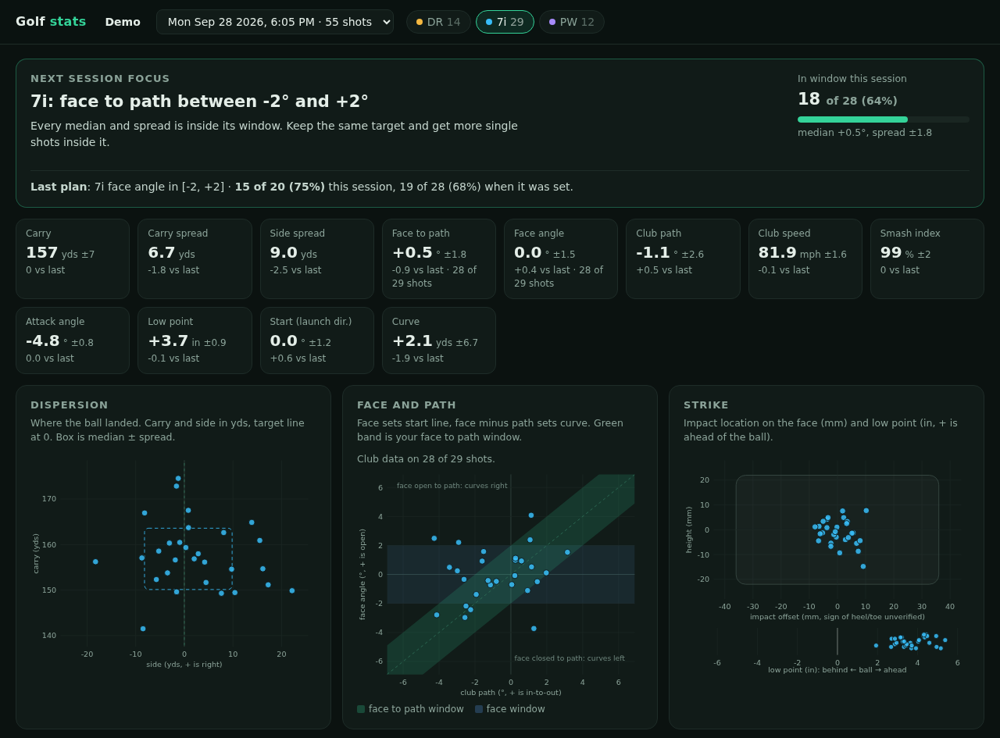

# golf-stats

Turns TrackMan 4 session exports into one practice focus per session, a graded plan for the
next session, and a local dashboard. Everything runs on your own files. An optional upload
site on Cloudflare Pages lets each golfer sign in, upload exports from the sim PC, and see
their dashboard. The site stores files and shows results. The analysis runs on your machine
when you run `bin/golf sync`. See [Upload site](#upload-site).



The screenshot comes from `bin/golf demo`, which builds sessions from synthetic shots.

## After each session

1. In TPS: Practice, Shot Analysis, Library, pick the session, switch to Table View, select
   all shots, click the export icon, choose **TrackMan CSV File**, leave **Normalize data**
   unchecked, Export All. Save it to a USB stick.
2. Copy the file into `data/inbox/`.
3. Run `bin/golf ingest`.
4. Open `data/dashboard-<player>.html`, one per player in the export, for example
   `data/dashboard-jordan.html`. Each file holds only that player's sessions, so it can be sent
   to them on its own. `data/dashboards.json` records which file belongs to which player, so a
   file never changes owner when a player with a similar name shows up later. The report for
   each session is in `data/reports/`.

Ingest stores each export byte for byte in `data/golf.db` as an upload with its ingestion
time, removes it from the inbox, skips a file it has seen, and skips shots already stored, so
exporting the whole library again is safe. `bin/golf uploads` lists every stored upload.
A database from before uploads, with files in `data/raw/`, migrates on first open. The
migration first copies it to `data/golf.db.bak-<time>`.
A shot is identified by player, timestamp and club. If a new file carries a stored shot with
different values in any measurement, the spin type, tags, the ball or the condition text (for
example the same session exported with Normalize on), ingest keeps the stored values, reports
the conflict on every run, and leaves the file in the inbox until `bin/golf ingest --replace`
takes the new file's values. Replacing an earlier session also refreshes the reports of later
sessions, because their comparisons and plan grades depend on it.
A file that fails to parse stays in the inbox and the error names the line, column or unit at
fault. A number the parser cannot read unambiguously fails the whole file rather than becoming
a gap: a thousands separator, both `.` and `,` used as a decimal mark in one file, or a column
whose every decimal value has exactly three digits after the mark.
Only the inbox's own entries are deleted. A file passed by path from elsewhere, or the target
of a symlink placed in the inbox, is never deleted.

## Upload site

`docs/WEB.md` is the spec of record for the site and for `bin/golf sync`.

Each golfer signs in, uploads one or more exports, and sees the upload at once with its raw
shots. A file whose players are not the golfer's asks for confirmation first. Every upload
keeps its time and uploader, a second copy of the same file is refused, and a wrong upload
can be reverted and restored on the Uploads page. Nothing is deleted. A file above about
1 MB can exceed the free plan's CPU limit. Ingest a big library export locally and sync it.

The site runs no analysis. Run this on your machine when you want fresh stats:

```
bin/golf sync
```

Sync pushes files ingested locally, pulls every site upload and its state into
`data/golf.db`, and publishes each upload's result and one dashboard per site user. Uploads
newer than the last sync show as pending on the site.

### Deploy

The site needs a Cloudflare account and Node 22 or later. The free plan is enough.

1. `cd web && npm install`
2. `npx wrangler d1 create golf-stats`, then put the printed `database_id` in
   `web/wrangler.toml`.
3. `npx wrangler d1 migrations apply golf-stats --remote`
4. `npx wrangler pages project create golf-stats`, then `npx wrangler pages deploy public`.
   In the Pages project settings, bind D1 database `golf-stats` as `DB`.
5. Make a sync token with `python3 -c "import secrets; print(secrets.token_hex(32))"`. Store it
   with `npx wrangler pages secret put SYNC_TOKEN`. Every sync route answers 503 until it is
   set, and it must be at least 32 characters.
6. Save the site on your machine. Pipe the same token in, so it stays out of shell history:
   `bin/golf site --url https://golf-stats.pages.dev --token-stdin`. This writes
   `data/site.json` with mode 0600.
7. Add each golfer with the player names their exports use:
   `bin/golf user add jordan --player Jordan --display Jordan`. It asks for the password, or
   reads one line from stdin with `--password-stdin`. `bin/golf user passwd`, `players`,
   `list` and `remove` manage users later.

### Run it locally

`node web/dev/server.mjs --port 8788 --db /tmp/golf-site.db --token <token>` serves the same
pages and API over `node:sqlite`, which needs Node 22.5 or later. Point `bin/golf site` at
`http://127.0.0.1:8788`. `cd web && node --test test/` runs the site tests, and
`.venv/bin/python -m pytest -q tests/test_site_integration.py` runs the box against it.
To run that test against `npx wrangler pages dev public` instead, set `GOLF_TEST_SITE_URL`
to its `http://127.0.0.1:<port>` and `GOLF_TEST_SITE_TOKEN` to its `SYNC_TOKEN` binding.

## Commands

| Command | What it does |
|---|---|
| `bin/golf ingest [files...] [--replace]` | Import exports (default: everything in `data/inbox`), write reports and plans for the sessions they touch, rebuild the dashboard. `--replace` overwrites stored shots whose values differ |
| `bin/golf report [session]` | Print the report for a session (default: the latest) |
| `bin/golf sessions` | List sessions |
| `bin/golf dashboard` | Rebuild `data/dashboard-<player>.html` for every player |
| `bin/golf demo` | Build a dashboard from four synthetic sessions in `data/demo/` |
| `bin/golf uploads` | List stored uploads with their state and how many of their shots are used |
| `bin/golf site --url URL [--token-stdin]` | Save the upload site's URL and sync token in `data/site.json` |
| `bin/golf sync` | Push local uploads, pull site uploads, publish results and dashboards |
| `bin/golf user add\|passwd\|players\|list\|remove` | Manage site users |

## How the focus is picked

The focus picker looks at the club with the most counted shots, once it has at least
`focus.min_shots`. It checks strike before direction and stops at the first check that fails:

1. Too many mishits. A mishit is a shot whose smash factor is below
   `focus.mishit_smash_ratio` of your best with that club, rounded up to 0.001. Your best is the 90th percentile of
   that club's smash factor over this session and every earlier one, once the club has
   `focus.min_shots` shots with smash factor. The check fails when the share of mishits is above
   `focus.mishit_share_max`. Smash factor needs only club speed and ball speed, so this check
   runs on shots without face and path data.
2. Irons and wedges: too many shots bottoming out at or behind the ball.
3. Median Smash Index below target.
4. Heel-to-toe impact spread too wide.
5. Direction. The side miss is split into start line (side minus curve, driven by face angle)
   and curve (driven by face to path). Whichever spread is larger is checked first against
   its window.

A check that needs club data runs only when the club has at least `focus.min_shots` measured
values of it. Indoors TrackMan often drops club data on most shots (see `docs/TRACKMAN.md`).
Then start line is checked with launch direction, which is measured on every shot, and curve
is not checked, because TrackMan draws those flights straight. The report and dashboard show
how many shots each number came from when it is fewer than all.

If every check passes, it keeps face to path as the target so the pattern has to repeat, or
launch direction when club data is too sparse.
The chosen target becomes a plan, written to `data/plans/` as a record. The same player's next
session grades it: how many of the planned shots landed in the window, against the count when
it was set. The grade recomputes the plan from the previous session, so the file is never read. A
session with no plan of its own breaks the chain, so an older plan is never graded twice.

Every report and dashboard also has two sections that do not depend on the focus:

- **Strike** lists each rated club's mishits, where they started and how much carry they lost
  against solid strikes. On the dashboard's dispersion plot a mishit is drawn as a ring.
- **Bag** gives the median carry per club over this session and every earlier one, from
  solid strikes only when the club is rated, and the gap to the next shorter club.

A shot with no ball speed is a misread. TPS writes zeros for its flight. It is left out of
every number, and the report counts it.

Every threshold and window is in `config.toml`. They are starting heuristics, not TrackMan
guidance. `player.preferred_shape` moves the face to path window for a draw or a fade.
`[player.aliases]` maps one TPS player name to another, so both names share one dashboard.
Some exports from this unit name the player by the TrackMan account name instead of the name
typed at the bay. When the same shot is stored under both names, the copy imported first counts
and the other is ignored. A copy with no ball data gives way to one that has it. Any other
difference between the copies is reported on every run.

## Layout

```
bin/golf                  CLI wrapper (uses .venv/bin/python when present)
config.toml               player, session gap, focus thresholds and windows
docs/TRACKMAN.md          what the export and parameters look like, with confidence labels
docs/WEB.md               upload site and sync spec of record
src/golfstats/
  fields.py               TPS header names -> canonical keys and units
  tps_csv.py              parser: sep line, header, units row, unit conversion, dates
  store.py                SQLite upload ledger and ingest (dedupe by file hash and by shot)
  clubs.py                club names -> codes (DR, 7i, PW) and bag order
  stats.py                sessions, robust medians and spreads, shot shape, side-miss split
  strike.py               mishit rating from smash factor, and the bag table
  focus.py                focus picker, plan writing and grading
  report.py               markdown session report
  dashboard.py            builds the dashboard data
  dashboard.html          dashboard template (vanilla JS, inline SVG, works offline)
  synth.py                synthetic TPS exports for tests and the demo
  sync.py                 upload site client: login keys, push, mirror, publish
tests/                    pytest suite, offline
web/                      upload site: public/ pages, functions/ and src/ API, migrations/ D1 schema,
                          dev/ local server over node:sqlite, test/ node tests
data/                     gitignored: golf.db, inbox/, reports/, plans/, dashboard-<player>.html
```

Data flow: CSV, then `tps_csv` converts every value to mph, yds, ft, in, mm, deg and rpm by
its units row, then `store` keeps the file as an upload and its shots in SQLite with the
original row kept as JSON. The `shots` view picks one stored copy of each shot. Then `stats`
groups shots into sessions by time gap, and `focus`, `report` and `dashboard` read those
sessions.

## Setup

Python 3.12, standard library only at runtime, so running it needs no install. The tests need
pytest.

```
python3.12 -m venv .venv
.venv/bin/pip install -r requirements-dev.txt
.venv/bin/python -m pytest -q
```

## Known limits

- Indoors the radar tracks about 3 yds of flight, so carry, side and curve are TrackMan's
  predictions from launch and spin. The club numbers and launch numbers are measured.
- The export format matches one TPS export by another golfer and four from this unit. See
  `docs/TRACKMAN.md`.
- On this unit most shots have no club data, so the low point, Smash Index and curve checks
  often have too few values to run. The mishit check needs only club speed, and TrackMan drops
  that too on many driver shots.
- Right-handed only. The heel/toe sign of impact offset is unverified.
